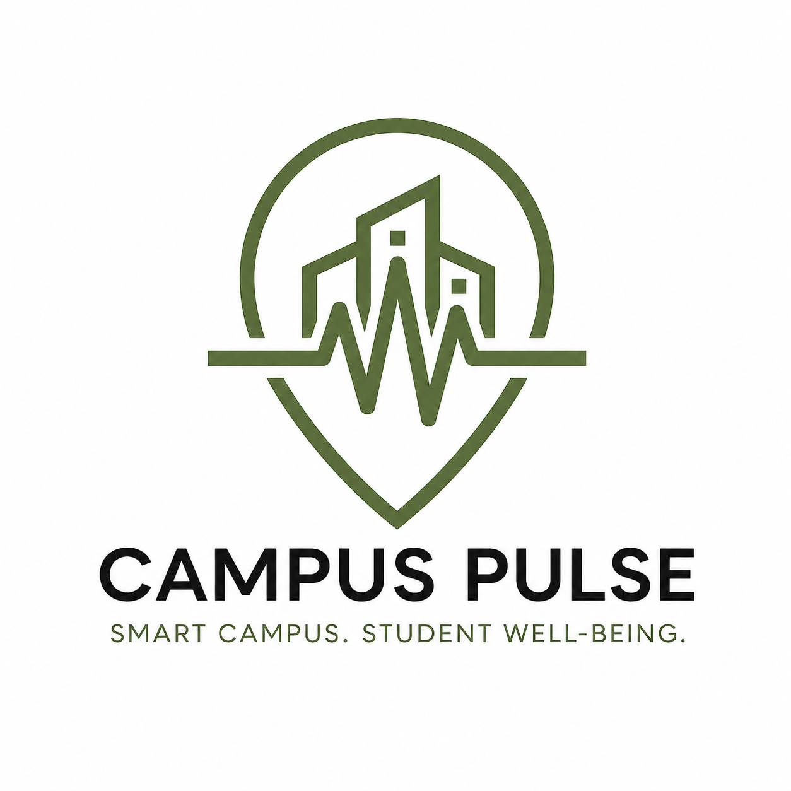
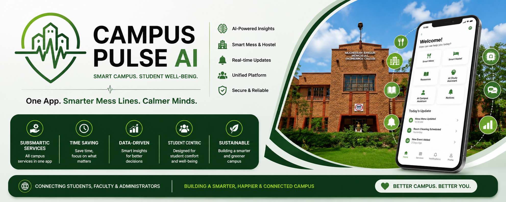

<p align="center">
  
</p>

<h1 align="center">🎓 Campus Pulse AI</h1>

<p align="center">
<b>One App. Smarter Mess Lines. Calmer Minds.</b>
</p>

<p align="center">
🏆 Developed for <b>EPIC Hackathon 2026</b><br>
🎓 MBM University, Jodhpur
</p>

<p align="center">
  
</p>

---

## 📖 About the Project

Campus Pulse AI is an AI-powered Smart Campus Management System designed to improve student well-being by bringing all essential campus services into one intelligent platform.

Instead of using multiple disconnected systems for mess management, hostel allocation, academic communication, study planning, resource booking, notifications, and student support, Campus Pulse AI integrates everything into a single application powered by Artificial Intelligence.

The platform enables students, faculty, and administrators to collaborate efficiently while providing intelligent recommendations, real-time insights, predictive analytics, and personalized campus services.

---

## 🎯 Problem Statement

Campus students face several everyday challenges that directly impact their academic performance and overall campus experience.

Some of the major problems include:

- 🍽️ Food wastage due to uncertain mess attendance
- 🏠 Inefficient hostel room allocation
- 📅 Difficulty in booking campus resources
- 📚 Academic stress during examination periods
- 💬 Limited communication between students and faculty
- 🔔 Scattered notifications across multiple platforms
- 🧠 Lack of centralized AI-powered student assistance

Campus Pulse AI addresses these problems through one unified intelligent platform.

---

# ✨ Key Features

Campus Pulse AI combines multiple campus services into one intelligent platform.

| Feature | Description |
|---------|-------------|
| 🍽️ Smart Mess Management | Predicts daily meal attendance to reduce food wastage and optimize meal preparation. |
| 🏠 Smart Hostel Allocation | AI-assisted room allocation based on student preferences and compatibility. |
| 📅 Smart Resource Scheduler | Reserve classrooms, study rooms and labs with conflict detection. |
| 🤖 AI Campus Assistant | 24×7 AI chatbot for campus guidance, FAQs and student support. |
| 📚 AI Study Assistant | Personalized study planner, reminders and burnout prevention. |
| 💬 Academic Connect | Direct communication between students and faculty with file sharing. |
| 📢 Opportunity Hub | Hackathons, internships, workshops and campus opportunities in one place. |
| 🔔 Smart Notifications | Real-time announcements and personalized alerts. |
| 📖 Digital Library | Centralized access to academic resources and notes. |
| 🔒 Privacy & Security | Role-based secure authentication and protected student data. |

---

# 🧠 AI Decision Engine

The AI Decision Engine is the core intelligence of Campus Pulse AI. It continuously analyzes campus data and generates smart recommendations to improve campus operations and enhance the student experience.

### AI analyzes:

- 🍽️ Mess attendance patterns
- 🏠 Hostel allocation requests
- 📅 Resource booking schedules
- 📚 Student study plans
- 💬 Academic communication
- 🔔 Campus notifications
- 📊 Student activity trends

### AI Capabilities

- 📈 Predicts daily mess attendance to reduce food wastage.
- 🏠 Recommends suitable hostel room allocation.
- 📅 Detects scheduling conflicts before resource booking.
- 📚 Generates personalized study plans and reminders.
- 🤖 Provides instant AI-powered campus assistance.
- 🔔 Delivers intelligent notifications based on user activity.

> **The AI Decision Engine transforms campus data into actionable insights, enabling smarter decisions, efficient resource utilization, and a better campus experience for every student.**

---

# 📱 Prototype Showcase

Campus Pulse AI includes a complete high-fidelity mobile application prototype designed using a modern and user-friendly interface.

The prototype demonstrates the complete user journey for Students, Faculty, and Administrators.

### Prototype Modules

- 🟢 Splash Screen
- 🔐 Login & Authentication
- 👤 Role Selection
- 🏠 Student Dashboard
- 🍽️ Smart Mess Management
- 🏡 Smart Hostel Allocation
- 📅 Smart Resource Scheduler
- 📢 Campus Events
- ❤️ Student Wellness
- 🤖 AI Campus Assistant
- 📖 AI Study Assistant
- 💬 Academic Connect
- 📚 Digital Library
- 🔔 Smart Notifications
- 👨‍🏫 Teacher Dashboard
- 📊 Admin Dashboard
- ⚙️ Settings & Profile

> **The repository contains 21 high-fidelity prototype screens representing the complete Campus Pulse AI user experience.**

---

# 🏗 System Architecture

Campus Pulse AI follows a centralized AI-driven architecture that connects Students, Faculty, and Administrators through a unified platform.

## Architecture Overview

- 👨‍🎓 **Students**
  - Access campus services
  - Book resources
  - Receive AI recommendations
  - Track mess and hostel updates

- 👨‍🏫 **Faculty**
  - Share study materials
  - Manage academic communication
  - Respond to student queries

- 🏢 **Administrators**
  - Monitor campus operations
  - Manage resources
  - Analyze reports and insights

### Core Components

- 🤖 AI Decision Engine
- ☁️ Centralized Cloud Database
- 📱 Mobile Application
- 🔔 Notification Service
- 🔐 Secure Authentication
- 📊 Analytics Dashboard

The architecture enables real-time collaboration, intelligent recommendations, secure data management, and efficient campus operations through a single integrated platform.

<p align="center">
  
</p>
---


# 🔄 Prototype Workflow

The following workflow represents the complete journey of a user through Campus Pulse AI.

```text
Start
  │
  ▼
Launch Campus Pulse AI
  │
  ▼
Login / Authentication
  │
  ▼
Select User Role
(Student / Faculty / Admin)
  │
  ▼
Open Dashboard
  │
  ├──────────────┬──────────────┬──────────────┐
  ▼              ▼              ▼              ▼
Smart Mess   Smart Hostel   Resource Scheduler   AI Assistant
  │              │              │              │
  ▼              ▼              ▼              ▼
Predict Meal  Room Request   Book Resource   Get AI Help
Attendance
  │              │              │              │
  └──────────────┴──────────────┴──────────────┘
                 │
                 ▼
         AI Decision Engine
                 │
                 ▼
Notifications & Recommendations
                 │
                 ▼
 End User Experience
```

The workflow demonstrates how Campus Pulse AI integrates multiple campus services into one intelligent platform. Every user request is processed through the AI Decision Engine, which generates smart recommendations, improves operational efficiency, and enhances the overall campus experience.

<p align="center">
  
</p>

---


# 🛠 Technology Stack

| Category | Technologies |
|----------|--------------|
| 🎨 UI/UX Design | Canva |
| 🤖 Artificial Intelligence | AI Decision Engine (Conceptual) |
| 📱 Prototype | High-Fidelity Mobile UI Prototype |
| 🗄️ Database | Firebase (Proposed) |
| ☁️ Cloud Platform | Google Cloud / AWS (Proposed) |
| 🔔 Notifications | Firebase Cloud Messaging (Proposed) |
| 🔐 Authentication | Firebase Authentication (Proposed) |
| 📊 Analytics | AI-based Insights & Reports |
| 💻 Version Control | Git & GitHub |

> **Campus Pulse AI is currently presented as a high-fidelity prototype developed for the EPIC Hackathon. The listed technologies represent the proposed implementation stack for future development.**

---

# 📂 Repository Structure

```text
Campus-Pulse-AI/
│
├── assets/                # Logo, banners and project assets
├── diagrams/              # Architecture and workflow diagrams
├── docs/                  # Project documentation
├── ppt/                   # Presentation slides
├── prototype/             # 21 High-Fidelity Prototype Screens
├── LICENSE
└── README.md
```

The repository is organized to maintain a clean structure, making it easy to navigate project resources, documentation, and prototype assets.

---

# 👥 Team Nova

**Project:** Campus Pulse AI

**Developed for:** EPIC HACKATHON 2026  
**Organization:** MBM UNIVERSITY, Jodhpur

### Team Members

- Dular Solanki
- Vatsal
- Devvrat Mishra
- Chandrika Solanki
- Isha Agrawal

---

# 🔮 Future Scope

Campus Pulse AI can be expanded with several advanced features, including:

- 📡 IoT-enabled Smart Campus Integration
- 🤖 Advanced AI & Machine Learning Models
- 💳 Digital Campus ID and Cashless Payments
- 🚍 Smart Transport Tracking
- 🩺 Student Health & Wellness Monitoring
- 📈 Predictive Analytics for Campus Administration
- 🌐 Multi-Campus Support

The long-term vision is to build a unified intelligent campus ecosystem that enhances student life and improves institutional efficiency.

---

# 📜 License

This project is licensed under the **MIT License**.

See the [LICENSE](LICENSE) file for more details.
